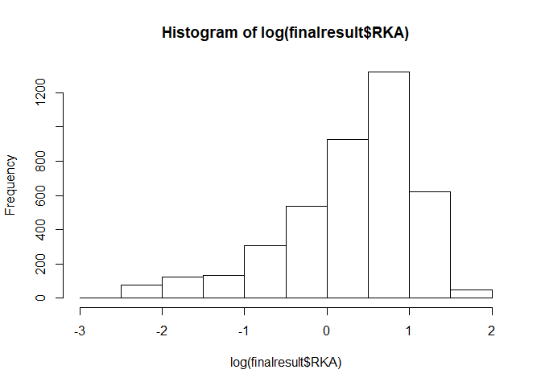

HiTS-EQ
-------

This is the document for calculation of more than 4000 association
constants from HiTS-EQ Next generation sequencing dataset.

1.  Input your data. The data format is in .csv file and the csv file
    format is shown below.

<!-- -->

    #Data input
    test.import <- read.csv('import_data.csv', header=T)
    head(test.import)

    ##      Seq   X1      X2     X3      X4
    ## 1      f    0    0.25    0.5    0.75
    ## 2    [E]    0    6.67   20.0   60.00
    ## 3 AAAAAA 4133 1425.00 1754.0 1422.00
    ## 4 AAAAAC 2662 1049.00  998.0  953.00
    ## 5 AAAAAG 5247 2726.00 2612.0 2322.00
    ## 6 AAAAAT 3352 1115.00 1073.0  842.00

Here f means fraction of reaction and the 100% binding is 1. 0.5 means
50% E-S complex formation or \[ES\]/\[S\]) = 0.5.

    test <- test.import[-(1:2),]
    frac <- 1-as.numeric(test.import[1,2:5])
    Enzyme <- as.numeric(test.import[2,2:5])
    names(test)<-c("sequence","t0","t1","t2","t3")
    #calculate the summation and mole fraction
    sum <- apply(test[,2:5],2,sum)
    test$ft0 <- test$t0/sum[1]
    test$ft1 <- test$t1/sum[2]
    test$ft2 <- test$t2/sum[3]
    test$ft3 <- test$t3/sum[4]

    #calculate the fraction of individual substrate
    test$fr0 <- 1-test$ft0/test$ft0*frac[1]
    test$fr1 <- 1-test$ft1/test$ft0*frac[2]
    test$fr2 <- 1-test$ft2/test$ft0*frac[3]
    test$fr3 <- 1-test$ft3/test$ft0*frac[4]

    #convert negative to random small amount in test

    for(i in 1:length(test[,1])){
      for(j in 10:13){
       if(test[i,j] < 0){
         test[i,j] <- abs(rnorm(1,0)/100)
       } 
      }
    }

    #fitting
    test$K <- 0

    for (i in 1:length(test[,1])){
      data.ft <- cbind(Enzyme,t(test[i,10:13]))
      data.ft <- data.frame(data.ft)
      names(data.ft) <- c("Enzyme","f")
      dirf <- nls( f ~ Enzyme/(Enzyme + K), data = data.ft)
      test$K[i] <- coef(dirf)
    #Export final result  
    finalresult <- test[,c("sequence","K")]
    finalresult$KA <- 1/finalresult$K
    finalresult$RKA <- finalresult$KA/finalresult$KA[3]
    }

Result output
-------------

After fitting, the association constant (KA), dissociation constant (K),
and relative association constant (RKA) will be exported in the
following format.

    head(finalresult)

    ##   sequence         K         KA      RKA
    ## 3   AAAAAA  7.968890 0.12548800 1.885934
    ## 4   AAAAAC  8.600381 0.11627392 1.747457
    ## 5   AAAAAG 15.028800 0.06653891 1.000000
    ## 6   AAAAAT  6.204218 0.16118068 2.422352
    ## 7   AAAACA  4.823659 0.20731150 3.115643
    ## 8   AAAACC  5.540732 0.18048156 2.712421

To export your file, please change the export filename in HiTS-EQ\_v2.R
script.

    write.csv(finalresult,"output.csv")

Show the RKA distribution by histogram
--------------------------------------

To observe the distribution of relative association constants, we used
RKA and log(RKA). log(RKA) has more physical meanings in binding energy.

