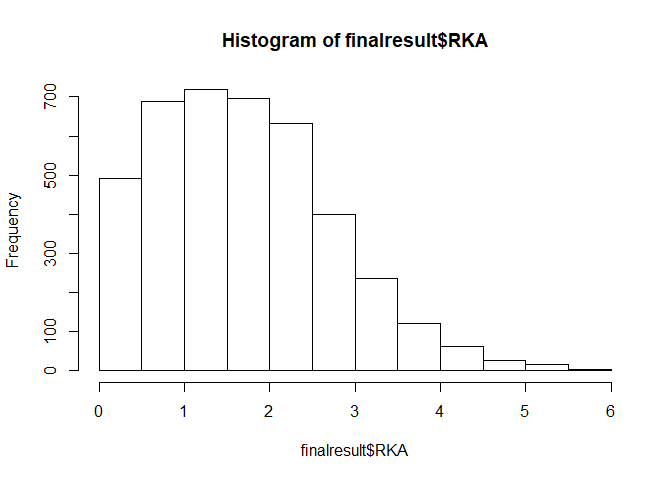

HiTS-EQ
-------

This is the document for calculation of more than 4000 association
constants from HiTS-EQ Next generation sequencing dataset.

1.  Input your data. The data format is in .csv file and the csv file
    format is shown below.

<!-- -->

    #Data input
    test.import <- read.csv('import_data.csv', header=T)
    head(test.import)

    ##      Seq   X1      X2     X3      X4
    ## 1      f    0    0.25    0.5    0.75
    ## 2    [E]    0    6.67   20.0   60.00
    ## 3 AAAAAA 4133 1425.00 1754.0 1422.00
    ## 4 AAAAAC 2662 1049.00  998.0  953.00
    ## 5 AAAAAG 5247 2726.00 2612.0 2322.00
    ## 6 AAAAAT 3352 1115.00 1073.0  842.00

Here f means fraction of reaction and the 100% binding is 1. 0.5 means
50% E-S complex formation or \[ES\]/\[S\]) = 0.5.

'''{r echo=FALSE} test &lt;- test.import\[-(1:2),\] frac &lt;-
1-as.numeric(test.import\[1,2:5\]) Enzyme &lt;-
as.numeric(test.import\[2,2:5\])
names(test)&lt;-c("sequence","t0","t1","t2","t3") rm(filename) ''' \#\#
Including Plots

You can also embed plots, for example:

Note that the `echo = FALSE` parameter was added to the code chunk to
prevent printing of the R code that generated the plot.
